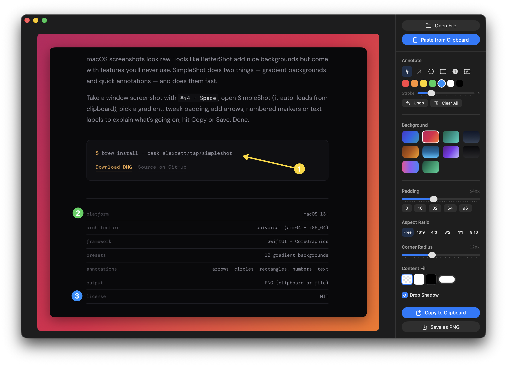

# SimpleShot

A tiny macOS app that wraps your screenshots in beautiful gradient backgrounds and lets you annotate them. Take a window screenshot, open SimpleShot, pick a gradient, add arrows and labels, copy or save.



## Why?

macOS screenshots look raw. Tools like CleanShot add nice backgrounds but come with features you'll never use. SimpleShot does two things — gradient backgrounds and quick annotations — and does them fast.

## Taking Screenshots on macOS

The fastest way to get a window screenshot into SimpleShot:

1. Press **⌘⇧4** to enter selection mode
2. Press **Space** — cursor turns into a camera, hover over the window you want
3. Hold **⌃ (Control)** and click — this saves the screenshot to clipboard instead of a file
4. Open SimpleShot — it auto-loads from clipboard

> **Tip:** Without holding Control, the screenshot saves to Desktop as a file. With Control held, it goes straight to clipboard — perfect for SimpleShot's auto-paste.

You can also drag & drop image files, open via **⌘O**, or paste files copied in Finder. Supports PNG, JPEG, TIFF, GIF, BMP, HEIC, WebP, PDF, SVG and more.

## How It Works

1. Take a screenshot (see above) or open/drop any image file
2. Open SimpleShot — it auto-loads the clipboard image
3. Pick a gradient preset, adjust padding and corner radius
4. Add annotations — arrows, circles, numbered markers, text
5. Select and move annotations with the pointer tool, recolor or edit text
6. **Copy to Clipboard** or **Save as PNG**

## Features

- **Auto-paste** — opens with clipboard image ready
- **File import** — drag & drop, open dialog (⌘O), paste files from Finder
- **Broad format support** — PNG, JPEG, TIFF, GIF, BMP, HEIC, WebP, PDF, SVG
- **10 gradient presets** — Twilight, Sunset, Forest, Slate, Amber, Ocean, Lavender, Noir, Candy, Emerald
- **Adjustable padding** — slider + quick presets (0, 16, 32, 64, 96px)
- **Aspect ratio presets** — Free, 16:9, 4:3, 3:2, 1:1, 9:16
- **Corner radius** control
- **Content fill** — background for transparent images (white, black, custom color)
- **Drop shadow** toggle
- **Annotations** — arrows, circles, rectangles, numbered markers, text labels
- **Editable annotations** — select, move, recolor, change stroke, edit text
- **7 annotation colors** and adjustable stroke width
- **Undo** (⌘Z), **Delete** selected, and **Clear All** for annotations
- **Copy to clipboard** (⌘⇧C) or **Save as PNG** (⌘S)
- **Native macOS** — SwiftUI, zero dependencies

## Install

### Homebrew

```bash
brew install --cask alexrett/tap/simpleshot
```

### Download

Grab the latest `SimpleShot.dmg` from [Releases](https://github.com/alexrett/simpleshot/releases).

### Build from Source

```bash
git clone https://github.com/alexrett/simpleshot.git
cd simpleshot
swift build -c release --arch arm64 --arch x86_64
```

## Requirements

- macOS 13.0 (Ventura) or later
- Works on both Apple Silicon and Intel Macs

## License

MIT
